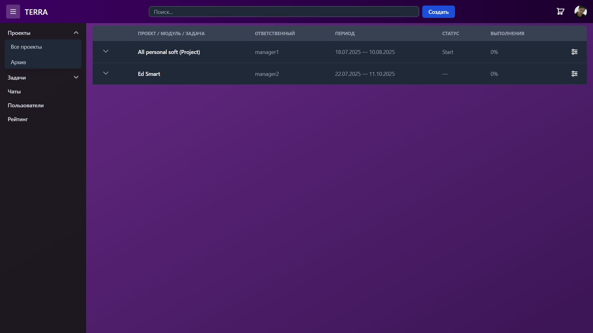

# 🧠 CONTROL HUMANITY 

**Control_Humanity** is a web-based platform designed to manage employees, assign tasks, and organize overall workflows efficiently.

With this system, you can:

- 👨‍💼 Monitor your employees performance,
- ✅ Plan and assign tasks effectively,
- 📈 Track productivity and progress,
- 📅 Manage projects in an organized, role-based manner.

The project is built using **Django (backend)** and **Vue.js (frontend)** technologies, offering users a clean interface, real-time Kanban board, and internal chat system to significantly improve team collaboration and productivity.

# ⚙️ INSTALITION 

    📁 Backend setup 

        cd backend
        python -m venv venv
        Set-ExecutionPolicy -Scope Process -ExecutionPolicy Bypass
        venv\Scripts\activate
        python -m pip install --upgrade pip
        python -m pip install -r requirements.txt

        python manage.py migrate
        python manage.py createsuperuser
        python manage.py runserver

    📁 Frontend setup 
        
        cd frontend
        Set-ExecutionPolicy -Scope Process -ExecutionPolicy Bypass
        npm install
        Get-Content packages.txt | ForEach-Object { npm install $_ }

        npm run dev
    
    📁 Telegram bot setup  
        
        cd telegram_bot
        Set-ExecutionPolicy -Scope Process -ExecutionPolicy Bypass
        python -m venv venv
        venv\Scripts\activate
        python -m pip install -r instalations.txt

        python bot.py

## 📜 Code of Conduct
We are committed to fostering a welcoming and respectful environment for all contributors.  
Please read our [Code of Conduct](CODE_OF_CONDUCT.md) before participating.

## 🔐 Security
If you discover a security vulnerability within this project,  
please review our [Security Policy](SECURITY.md) and report the issue responsibly.

## 📄 License
This project is licensed under the **MIT License**.  
See the [License](License) file for full license text.

Copyright © 2025 [WhyJamal](https://github.com/WhyJamal)